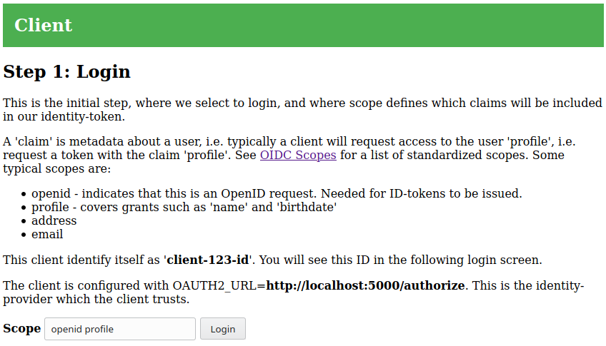
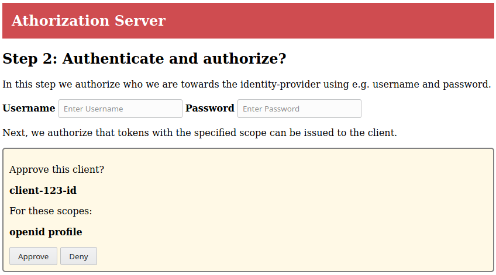
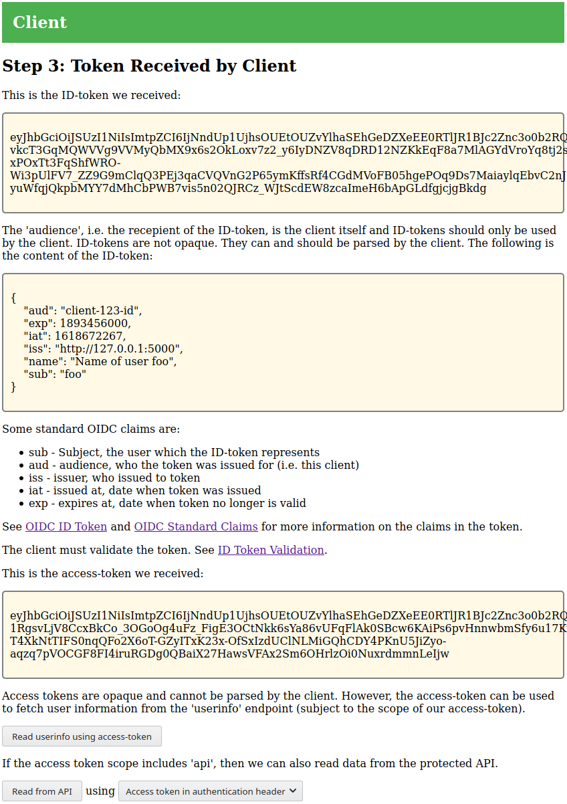
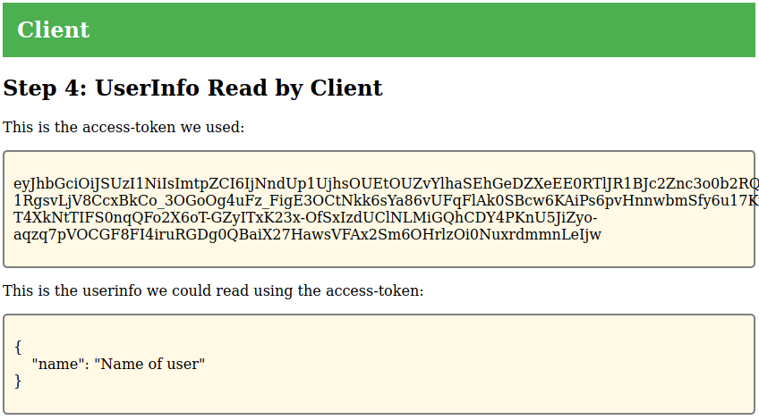

# OIDC/OAuth2 Workshop

This repository contain an example implementation of an OIDC/OAuth2 client
(confidential client), identity provider and protected resource.

The implementation is for educational purposes only and NOT suited for anything
that require real security.

## Usage

See below for how to start the client, identity provider and protected
resource. This section presents an usage example.

The client is available at `http://localhost:5001`. Point your browser at this
endpoint and you should see the following:

> 

This is the initial login step. The `scope` input defines our desired scope of
the OIDC/OAuth2 tokens we will obtain through the identity provider. Scopes are
space separated strings and the client defaults to `openid profile`, which is
the standard for OIDC. The protected resource in this workshop only allows
access if the scope `api` is included.

When you select `Login`, you are redirected to the Identity
provider/Authorization server (IdP):

> 

The IdP combines authentication and authorization and does not implement real
users. Thus you can enter any username and use the password `valid`.

When you select `Approve`, the IdP redirects your browser back to the client
which completes the OIDC/OAuth2 negotiation. The client will show information
about the tokens it received:

> 

The client supports reading the OIDC `userinfo` data from the IdP:

> 

The client also supports reading information from the protected resource
(OAuth2). The protected resource will respond differently depending on whether
the token contains the scope `api` or not. The following example show usage
without the `api` scope:

> 

## Running the Components

